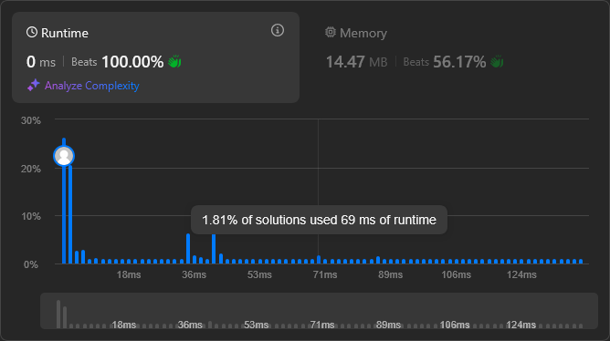

# https://leetcode.com/submissions/detail/1566400912/



*note: 100% or not - depends on the load of the node on leetcode*

```c++
namespace {
    
struct Entry {
  int num = 0;
  int idx = 0;
  int target = 0;
};

std::pair<int, int> two_sum(const std::vector<int> &nums, int target) {
  static std::vector<Entry> entries;
  entries.clear();
  entries.reserve(nums.size() + 2);
  entries.emplace_back(std::numeric_limits<int>::min(), std::numeric_limits<int>::min(),
                       std::numeric_limits<int>::min());
  for (int i = 0; i < nums.size(); ++i) {
    entries.emplace_back(nums[i], i, target - nums[i]);
  }
  std::sort(entries.begin(), entries.end(), [](const Entry &a, const Entry &b) {
    return a.num < b.num;
  });
  entries.emplace_back(std::numeric_limits<int>::max(), std::numeric_limits<int>::max(),
                       std::numeric_limits<int>::max());

  const auto begin = entries.begin() + 1;
  const auto end = entries.end() - 1;
  auto it = begin;
  for (; it != end; ++it) {
    // check if num equal target
    if (it->num == it->target) {
      auto target_it = it;
      if ((--target_it)->num == it->target) {
        return {it->idx, target_it->idx};
      }
      target_it = it;
      if ((++target_it)->num == it->target) {
        return {it->idx, target_it->idx};
      }
    }
    // check other
    const auto target_it = std::lower_bound(begin, end, it->target, [](const Entry &a, const int value) {
      return a.num < value;
    });
    if (target_it->num == it->target) {
      return {it->idx, target_it->idx};
    }
  }
  return {};
}

}

class Solution {
public:
    vector<int> twoSum(vector<int>& nums, int target) {
        const auto [a,b] = two_sum(nums, target);
        return {a,b};
    }
};

```